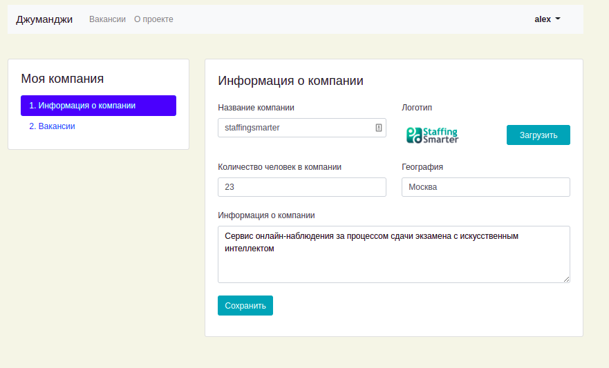

# Django (stepik course) (Сайт поиска вакансий)

### Описание

Сайт, на котором пользователи могут искать вакансии, разместить свою компанию, вакансии, делать отклики на интересующие вакансии.

### Технологии

Python      
Django      
Docker   
Nginx   
Gunicorn    

### Запуск проекта с помощью Docker-compose

- Склонируйте репозиторий:

```
git clone https://github.com/AlexeyPeresypkin/django_stepik.git
```

- Добавьте в корневую директорию файл `.env` с переменными окружения для работы с базой данных:

```
DB_ENGINE=django.db.backends.postgresql # указываем, что работаем с postgresql
DB_NAME=postgres # имя базы данных
POSTGRES_USER=postgres # логин для подключения к базе данных
POSTGRES_PASSWORD=postgres # пароль для подключения к БД (установите свой)
DB_HOST=db # название сервиса (контейнера)
DB_PORT=5432 # порт для подключения к БД
```

- Запустите docker-compose командой `sudo docker-compose up -d` 
- Войдите в запущенный контейнер         
`docker exec -it <CONTAINER ID (web)> bash`
- Соберите статику командой `./manage.py collectstatic`
- Создайте таблицы БД `./manage.py makemigrations`
- Накатите миграции `./manage.py migrate`
- По необходимости заполняем БД данными:
- `./manage.py loaddata db.json`




